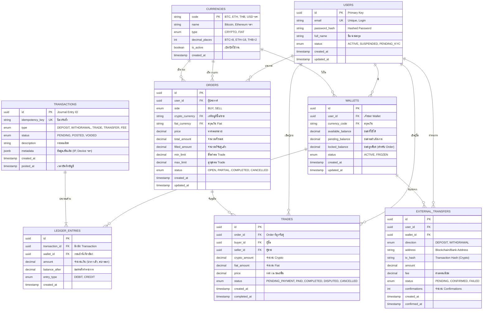

# ER Diagram - P2P Crypto Exchange API

## ภาพรวมระบบ

ระบบ P2P Crypto Exchange สำหรับการแลกเปลี่ยน Cryptocurrencies (BTC, ETH, XRP, DOGE) ด้วยเงิน Fiat (THB, USD) ออกแบบตามหลักการ **Double-Entry Bookkeeping** เพื่อความถูกต้องและตรวจสอบได้

---

## Entity-Relationship Diagram (ERD)



---

## รายละเอียดตาราง (Data Type Specifications)

### 1. USERS - ข้อมูลผู้ใช้งาน

| Column          | Type         | Constraints           | Description                    |
| --------------- | ------------ | --------------------- | ------------------------------ |
| `id`            | UUID         | PRIMARY KEY           | ใช้ UUID เพื่อความปลอดภัย      |
| `email`         | VARCHAR(255) | UNIQUE, NOT NULL      | อีเมลสำหรับ Login              |
| `password_hash` | VARCHAR(255) | NOT NULL              | รหัสผ่านเข้ารหัส (bcrypt)      |
| `full_name`     | VARCHAR(100) | NOT NULL              | ชื่อ-นามสกุล                   |
| `status`        | ENUM         | DEFAULT 'PENDING_KYC' | ACTIVE, SUSPENDED, PENDING_KYC |
| `created_at`    | TIMESTAMPTZ  | DEFAULT NOW()         |                                |
| `updated_at`    | TIMESTAMPTZ  |                       |                                |

---

### 2. CURRENCIES - สกุลเงิน/เหรียญ

| Column           | Type        | Constraints   | Description                 |
| ---------------- | ----------- | ------------- | --------------------------- |
| `code`           | VARCHAR(10) | PRIMARY KEY   | BTC, ETH, THB, USD          |
| `name`           | VARCHAR(50) | NOT NULL      | Bitcoin, Thai Baht          |
| `type`           | ENUM        | NOT NULL      | CRYPTO, FIAT                |
| `decimal_places` | INTEGER     | NOT NULL      | BTC=8, ETH=18, THB=2, USD=2 |
| `is_active`      | BOOLEAN     | DEFAULT TRUE  |                             |
| `created_at`     | TIMESTAMPTZ | DEFAULT NOW() |                             |

**หมายเหตุ**: `decimal_places` สำคัญมากสำหรับการแสดงผลและคำนวณ

---

### 3. WALLETS - กระเป๋าเงิน

| Column              | Type           | Constraints                    | Description    |
| ------------------- | -------------- | ------------------------------ | -------------- |
| `id`                | UUID           | PRIMARY KEY                    |                |
| `user_id`           | UUID           | FK → users.id, NOT NULL        | เจ้าของ        |
| `currency_code`     | VARCHAR(10)    | FK → currencies.code, NOT NULL |                |
| `available_balance` | NUMERIC(36,18) | DEFAULT 0, CHECK >= 0          | ยอดใช้ได้      |
| `pending_balance`   | NUMERIC(36,18) | DEFAULT 0                      | ยอดรอ Confirm  |
| `locked_balance`    | NUMERIC(36,18) | DEFAULT 0                      | ยอดถูกล็อค     |
| `status`            | ENUM           | DEFAULT 'ACTIVE'               | ACTIVE, FROZEN |
| `created_at`        | TIMESTAMPTZ    | DEFAULT NOW()                  |                |
| `updated_at`        | TIMESTAMPTZ    |                                |                |

**Unique Constraint**: `(user_id, currency_code)` - 1 User มี 1 Wallet ต่อ 1 สกุลเงิน

---

### 4. ORDERS - ประกาศซื้อขาย P2P

| Column            | Type           | Constraints          | Description                         |
| ----------------- | -------------- | -------------------- | ----------------------------------- |
| `id`              | UUID           | PRIMARY KEY          |                                     |
| `user_id`         | UUID           | FK → users.id        | ผู้ประกาศ                           |
| `side`            | ENUM           | NOT NULL             | BUY, SELL                           |
| `crypto_currency` | VARCHAR(10)    | FK → currencies.code | เหรียญที่จะซื้อ/ขาย                 |
| `fiat_currency`   | VARCHAR(10)    | FK → currencies.code | สกุลเงิน Fiat                       |
| `price`           | NUMERIC(20,8)  | NOT NULL, CHECK > 0  | ราคาต่อ 1 หน่วย Crypto              |
| `total_amount`    | NUMERIC(36,18) | NOT NULL             | จำนวน Crypto ทั้งหมด                |
| `filled_amount`   | NUMERIC(36,18) | DEFAULT 0            | จำนวนที่จับคู่แล้ว                  |
| `min_limit`       | NUMERIC(20,2)  |                      | ขั้นต่ำ (Fiat)                      |
| `max_limit`       | NUMERIC(20,2)  |                      | สูงสุด (Fiat)                       |
| `status`          | ENUM           | DEFAULT 'OPEN'       | OPEN, PARTIAL, COMPLETED, CANCELLED |
| `created_at`      | TIMESTAMPTZ    | DEFAULT NOW()        |                                     |
| `updated_at`      | TIMESTAMPTZ    |                      |                                     |

---

### 5. TRADES - ประวัติการจับคู่

| Column          | Type           | Constraints               | Description         |
| --------------- | -------------- | ------------------------- | ------------------- |
| `id`            | UUID           | PRIMARY KEY               |                     |
| `order_id`      | UUID           | FK → orders.id            | Order ที่จับคู่     |
| `buyer_id`      | UUID           | FK → users.id             | ผู้ซื้อ             |
| `seller_id`     | UUID           | FK → users.id             | ผู้ขาย              |
| `crypto_amount` | NUMERIC(36,18) | NOT NULL                  | จำนวน Crypto        |
| `fiat_amount`   | NUMERIC(20,2)  | NOT NULL                  | จำนวน Fiat          |
| `price`         | NUMERIC(20,8)  | NOT NULL                  | ราคา ณ ขณะจับคู่    |
| `status`        | ENUM           | DEFAULT 'PENDING_PAYMENT' |                     |
| `created_at`    | TIMESTAMPTZ    | DEFAULT NOW()             |                     |
| `completed_at`  | TIMESTAMPTZ    |                           | เวลาที่เสร็จสมบูรณ์ |

**Trade Status Flow**: PENDING_PAYMENT → PAID → COMPLETED หรือ DISPUTED → CANCELLED

---

### 6. TRANSACTIONS - รายการทางบัญชี (Journal Entry)

| Column            | Type         | Constraints       | Description                               |
| ----------------- | ------------ | ----------------- | ----------------------------------------- |
| `id`              | UUID         | PRIMARY KEY       |                                           |
| `idempotency_key` | VARCHAR(255) | UNIQUE            | ป้องกันการบันทึกซ้ำ                       |
| `type`            | ENUM         | NOT NULL          | DEPOSIT, WITHDRAWAL, TRADE, TRANSFER, FEE |
| `status`          | ENUM         | DEFAULT 'PENDING' | PENDING, POSTED, VOIDED                   |
| `description`     | VARCHAR(500) |                   | รายละเอียด                                |
| `metadata`        | JSONB        |                   | {ip_address, device_id, ...}              |
| `created_at`      | TIMESTAMPTZ  | DEFAULT NOW()     |                                           |
| `posted_at`       | TIMESTAMPTZ  |                   | เวลาที่บันทึกบัญชี                        |

---

### 7. LEDGER_ENTRIES - รายการเคลื่อนไหว (Double-Entry)

| Column           | Type           | Constraints                    | Description              |
| ---------------- | -------------- | ------------------------------ | ------------------------ |
| `id`             | UUID           | PRIMARY KEY                    |                          |
| `transaction_id` | UUID           | FK → transactions.id, NOT NULL |                          |
| `wallet_id`      | UUID           | FK → wallets.id, NOT NULL      |                          |
| `amount`         | NUMERIC(36,18) | NOT NULL                       | บวก=เข้า, ลบ=ออก         |
| `balance_after`  | NUMERIC(36,18) | NOT NULL                       | Snapshot ยอดหลังทำรายการ |
| `entry_type`     | ENUM           | NOT NULL                       | DEBIT, CREDIT            |
| `created_at`     | TIMESTAMPTZ    | DEFAULT NOW()                  |                          |

> **กฎสำคัญ (Zero-Sum Rule)**: ในทุก Transaction ผลรวมของ `amount` ใน `ledger_entries` ต้องเท่ากับ **0**
>
> ```sql
> -- Constraint Check
> SELECT SUM(amount) FROM ledger_entries WHERE transaction_id = :id;
> -- ต้องได้ 0.000000000000000000 เสมอ
> ```

---

### 8. EXTERNAL_TRANSFERS - การโอนเข้า/ออกภายนอก

| Column          | Type           | Constraints       | Description                       |
| --------------- | -------------- | ----------------- | --------------------------------- |
| `id`            | UUID           | PRIMARY KEY       |                                   |
| `user_id`       | UUID           | FK → users.id     |                                   |
| `wallet_id`     | UUID           | FK → wallets.id   |                                   |
| `direction`     | ENUM           | NOT NULL          | DEPOSIT, WITHDRAWAL               |
| `address`       | VARCHAR(255)   |                   | Blockchain Address / Bank Account |
| `tx_hash`       | VARCHAR(100)   | UNIQUE            | Blockchain Tx Hash                |
| `amount`        | NUMERIC(36,18) | NOT NULL          |                                   |
| `fee`           | NUMERIC(36,18) | DEFAULT 0         | ค่าธรรมเนียม                      |
| `status`        | ENUM           | DEFAULT 'PENDING' | PENDING, CONFIRMED, FAILED        |
| `confirmations` | INTEGER        | DEFAULT 0         | สำหรับ Crypto                     |
| `created_at`    | TIMESTAMPTZ    | DEFAULT NOW()     |                                   |
| `confirmed_at`  | TIMESTAMPTZ    |                   |                                   |

---

## Data Type สำคัญ: NUMERIC(36, 18)

ใช้ `NUMERIC(36, 18)` สำหรับจำนวนเงินทุกที่ เพราะ:

- **ไม่เกิด Floating Point Error** (เช่น 0.1 + 0.2 ≠ 0.30000000000000004)
- **รองรับ Crypto ทศนิยมสูง** (ETH มี 18 ทศนิยม)
- **ป้องกัน Overflow** สำหรับจำนวนเงินขนาดใหญ่

---

## ความสัมพันธ์ระหว่างตาราง (Relationships Summary)

| ความสัมพันธ์                  | ประเภท | อธิบาย                                             |
| ----------------------------- | ------ | -------------------------------------------------- |
| Users ↔ Wallets               | 1:N    | 1 User มีหลาย Wallet (แต่ละสกุลเงิน)               |
| Users ↔ Orders                | 1:N    | 1 User ประกาศได้หลาย Order                         |
| Orders ↔ Trades               | 1:N    | 1 Order จับคู่ได้หลาย Trade (Partial Fill)         |
| Transactions ↔ Ledger_Entries | 1:N    | 1 Transaction มีอย่างน้อย 2 Entries (Debit/Credit) |
| Wallets ↔ Ledger_Entries      | 1:N    | 1 Wallet มีหลาย Entries                            |

---

## ตัวอย่าง Flow: การซื้อขาย P2P

```
1. User A ประกาศขาย 1 BTC ในราคา 1,500,000 THB
   → สร้าง Order (side=SELL, crypto=BTC, fiat=THB)
   → ล็อค 1 BTC จาก Wallet ของ A (locked_balance += 1)

2. User B ตอบรับซื้อ 0.5 BTC
   → สร้าง Trade (buyer=B, seller=A, amount=0.5)
   → สถานะ = PENDING_PAYMENT

3. User B โอนเงิน 750,000 THB แล้วกดยืนยัน
   → สถานะ Trade = PAID

4. User A ยืนยันรับเงิน
   → สร้าง Transaction (type=TRADE):
      - Ledger Entry 1: A.BTC -0.5 (DEBIT)
      - Ledger Entry 2: B.BTC +0.5 (CREDIT)
   → อัพเดท Order (filled_amount += 0.5)
   → สถานะ Trade = COMPLETED
```

---

## หมายเหตุสำหรับนักพัฒนา

1. **ห้าม DELETE/UPDATE ใน ledger_entries** - ใช้ Reversal Entry แทน
2. **ใช้ Transaction (BEGIN...COMMIT)** สำหรับทุกการเปลี่ยนแปลงยอดเงิน
3. **ใช้ SELECT FOR UPDATE** เมื่อดึงยอดเงินเพื่อป้องกัน Race Condition
4. **ตรวจสอบ Zero-Sum** ก่อน COMMIT ทุก Transaction

---

## Index แนะนำ

```sql
-- สำหรับ Query ประวัติธุรกรรม
CREATE INDEX idx_ledger_wallet_created ON ledger_entries(wallet_id, created_at DESC);

-- สำหรับค้นหา Order ที่ยังเปิดอยู่
CREATE INDEX idx_orders_open ON orders(status, crypto_currency, fiat_currency) WHERE status IN ('OPEN', 'PARTIAL');

-- สำหรับค้นหา Trade ที่รอดำเนินการ
CREATE INDEX idx_trades_pending ON trades(status) WHERE status NOT IN ('COMPLETED', 'CANCELLED');
```

---

_เอกสารนี้สร้างเพื่อตอบโจทย์ข้อ 1 ของข้อสอบ Backend - P2P Crypto Exchange System_
